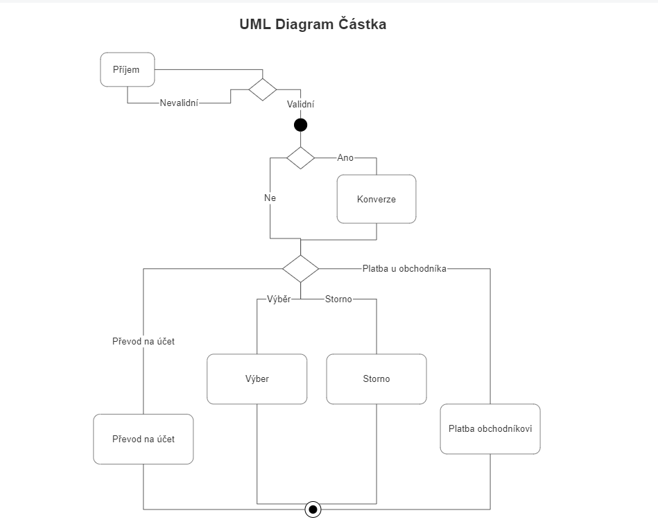

# Dokument specifikace požadavků

## Projekt: Bankovní systém

###  Úvod

Cílem semestrální práce je vytvořit bankovní systém, který umožní uživateli vytvářet a spravovat účty, provádět platby a převody mezi účty. 
Systém má být realizován tak, aby byl dostupný z jakéhokoliv zařízení s přístupem na internet.

### Zadání projektu z přednášky
DSP - dokument specifikace požadavků, v něm je požadován návrh systému, který bude realizován. Je nutné, specifikovat jak a co bude realizováno, a s jakými prostředky. V DSP by se měl nacházet následující obsah:
- blokové UML schéma čásky a operace které se s ní provádí
- system pro bank. Obyčejný informační systém
- potžebuje klienta, účty, kliets se účty otevírají, posílají peníze
- Klient má účet
- use case: 
    1. Platba (in, out, operations:+, -, měna), měna operaci počet: 1-n (externí zdroj dat), ná zákldadě měny rozhoduje o účtu stržení. 2. Přihlášení (přihlásím se - uvidím pohyby a zůstatek): dvoufázový (osobní číslo v aplikaci a kód do e-mailu)
- jak se realizují platby? (Náhodný generátor pro částku a měnu)
- rozhraní (UI): musí fungovat na PC a mobilu, tlačítko platba, výpisy, (částka a měna)
- historie všech operací pro uživatele 
- vytvoření nového uživatele nebo předvytvořit řučně (2-3 testovací klienti)
- 1 účet, více měn
- na účtu nemůže nastat záporný zůstatek 
- aktuální kurz měn se bere z české národní banky https://www.cnb.cz/cs/financni-trhy/devizovy-trh/kurzy-devizoveho-trhu/kurzy-devizoveho-trhu/denni_kurz.txt;jsessionid=8BF1C86A067EBBFABDF02CA6291B7538?date=08.03.2023
- zajímá nás pouze aktuální kurz
- soubory: 3 - info o účtu, měně a historii
- backend někde běží + frontend (UI) a jejich komunikace 
- ideální implementací je webová stránka

### Bodové zadání:
1. Bankovní informační systém
2. základní stavební bloky
   1. účet (číslo, měna)
   2. měna účtu
   3. platba
   4. vložení peněz na účet
3. data:
   1. uživatel (jméno a příjmení, email)
   2. účet (číslo, vlastník, měna)
4. Use cases:
   1. vlož peníze
   2. vlož peníze + převod pokud se jedná o jinou měnu ve které nemá klient vedený účet
   3. platba u obchodníka
   4. platba u obchodníka + převod mezi měnou
   5. přehlášení k účtu (uživatelské jmeno, PIN)
   6. dvoufázové ověření uživatele při přihlášení (email, osobní číslo)
   7. výpis účtu (pohyby, zůstatky, dle měn)
5. UI:
	1. musí běžet na PC i mobilním telefonu
	2. bez omezení na technologie, oddělený backend a frontend
6. Podmínky odevzdání:
   1. DSP (odevzdání do 22. 4. včetně emailem na roman.spanek@tul.cz)
   2. ukázka repo + commits + PULL REQUESTs 
   3. funkční CI/CD pro testování a nasazení
   4. pokrytí kódy testy na 70%, získané z CI/CD, tedy na přímo v IDE
   5. ukázka je aplikace funguje

---

# Návrh řešení
## Architektura systému

Bankovní systém bude realizován jako webová aplikace, která bude sestávat z backendu a frontendu. Backend bude napsán v programovacím jazyce Python a bude využívat webový framework Flask. Frontend bude napsán v HTML, stylizace v CSS a komunikaci a scriptování v JavaScriptu s možným využítím knihovny React. Pro komunikaci mezi backendem a frontendem bude využit protokol WSGI. Pro spuštění backendu bude využit kontejner Docker a nasezení na server bude realizováno pomocí CI/CD. Backenb poběží na službě Render.com

## Databáze

**User**

Entita User bude reprezentovat uživatele bankovního systému a bude obsahovat následující atributy:

- id: integer
- name: string
- email: string
- PIN: string

**Account**

Entita Account bude reprezentovat bankovní účet a bude obsahovat následující atributy:

- id: integer
- user_id: integer (cizí klíč na entitu User)
- currency: string
- balance: float

**Transaction**

Entita Transaction bude reprezentovat bankovní transakci a bude obsahovat následující atributy:

- id: integer
- sender_account_id: integer (cizí klíč na entitu Account)
- receiver_account_id: integer (cizí klíč na entitu Account)
- amount: float
- currency: string
- date: datetime

# Popis funkcí
##  Funkční požadavky
1. Uživatel může vytvořit nový účet a vložit na něj peníze.
2. Uživatel může provádět platby a převody mezi účty.
3. Uživatel může vidět historii operací na svých účtech.
4. Do systém musí přihlašovat pomocí dvoufázového ověření.
5. Uživatel musí mít možnost zobrazit své zůstatky na jednotlivých účtech a v jednotlivých měnách.
6. Systém musí být schopen vyčítat aktuální kurz měn pomocí dat z České národní banky.
7. Systém musí být schopen detekovat a zabránit transakcím, které by vedly k zápornému zůstatku na účtu.

## Nefunkční požadavky
1. Rychlost a dostupnost
   - odezva systému musí být od 1 do 3 sekund po odeslání požadavku
   - systém musí být dostupný 24/7 
   - systém musí být schopen obslouži alespoň 5 uživatelů současně.
   - systém musí být schopen obsloužit alespoň 100 uživatelů za den.
  
2. Uživatelské rozhraní musí být intuitivní a snadno použitelné.
   - velikost fontu musí být alespoň 16px
   - barvy musí být kontrastní
   - tlačítka musí být dostatečně velká alespoň velikosti 1 palce, 
  
3. Systém musí být dostupný z libovolného zařízení s prohlížečem.
   - škálovatelnost na různé velikosti obrazovky
  
4. Systém musí být bezpečný a chráněný proti útokům.
   - pro přístup do systému musí být vyžadováno přihlášení a dvoufázové ověření pomocí emailu (autentizace)
   - všechny příchozí požadavky musí být validovány
   - všechny vstupy musí být validovány a ošetřeny alespoň vůči proti SQL injections
   - hesla musí být ukládána v šifrované podobě (hash + salt) werkzeug.security
   - dvoufázové ověření kodu pomocí emailu, taktéř šifrováno
   - šifrování komunikace pomocí HTTPS
   - všechny operace musí být prováděny v transakcích
  
5. Systém musí být škálovatelný pro možnost přidání dalších funkcionalit.
   - systém musí být navržen tak, aby bylo možné přidat další měny
   - systém musí být navržen tak, aby bylo možné přidat další typy účtů
   - systém musí být navržen tak, aby bylo možné přidat další typy transakcí
   - systém musí být navržen tak, aby bylo možné přidat další typy uživatelů (např. firemní účty, účty pro děti, admin účty)
  
6. Systém musí být navržen tak, aby byl snadno udržovatelný a rozšiřitelný.
   - kód musí být rozdělen do logických modulů
   - kód musí být dobře čitelný a dokumentovaný pomocí docstringů
   - kód musí být pokrytý testy (alespoň 80%)
   - kód musí být verzován pomocí Git, pro každou novou funkčnost musí být vytvořena nová větev, která bude následně mergována do mainu pomocí pull requestu

### Omezení aplikace službou Render při použití verze zdarma:
- 0.1 CPU, zvlášní výpočetní výkon (nejsou bližžší infomarce) který je přidělen kontejneru, znamená omezenou rychlost zpracování požadavků
- maximální velikost kontejneru je 1 GB
- Data jsou ukládána do paměti, při restartu kontejneru se ztrácí
- Kontejner se vypne po 30 minutách nečinnosti
- Data v databázi jsou ukládána pouze po dobu  90 dní
- Webová aplikace musí být dostupná na portu 8080 ostatní porty jsou blokovány
- Zdrojový kód musí být veřejně dostupný na GitHubu
- Omezená škálovatelnost počtu aktivní uživatelů používající službu je omezena na 10
- build aplikace musí být dokončen do 10 minut jinak je přerušen maximální doba biuldu měsičně nesmí překročit 500 minut
- zpomalená odezva služby vůči uživateli, při použití verze zdarma (není uvedeno o kolik)

### Omezení aplikace službou SendGrid při použití verze zdarma:
- maximální počet odeslaných emailů je 300 denně
- uživatel který přijímá email musí být uložen v adresáři
- maximální velikost emailu je 15 MB

#  Use cases (scénáře použití)

###  UML diagram

### 4.2. Registrace uživatele
1. Uživatel otevře stránku s registračním formulářem.
2. Uživatel vyplní formulář s požadovanými údaji
3. Uživatel potvrdí odeslání formuláře.
4. Systém zkontroluje správnost vyplněných údajů, například platnost emailové adresy nebo shodu hesel.
5. Pokud jsou údaje vyplněny správně, uživatel je upozorněn na úspěšnou registraci a instruován k přihlášení.
6. Pokud jsou údaje vyplněny nesprávně, uživatel je upozorněn na chybu a vyzván k jejímu opravení.
7. Po úspěšné registraci je uživatel přesměrován na přihlašovací stránku.
   
###  Přihlášení uživatele
1. Uživatel otevře přihlašovací stránku.
2. Uživatel vyplní přihlašovací údaje, jako jsou přihlašovací jméno a heslo.
3. Uživatel potvrdí odeslání přihlašovacích údajů.
4. Systém zkontroluje správnost přihlašovacích údajů.
   1. Pokud jsou přihlašovací údaje správné, uživateli je emailem odeslán 6 místný ověřovací kód a je přesměrován na stránku s ověřovacím formulářem.
   2. Jinak je uživatel upozorněn na chybu v zadaných údajích a vyzván k jejich opravení (nebude specifikováno, zda se jedná o chybné přihlašovací jméno nebo heslo, aby se zabránilo útokům na heslo)
5. Uživatel vyplní ověřovací kód, který mu přišel na email a zadá ho do formuláře. Pokud se jedná o správný kód, uživatel je přihlášen a přesměrován na hlavní stránku. Jinak je uživatel upozorněn na chybný kód a vyzván k jeho opravení, v případě že uplyne 5 minut od odeslání kódu, je uživatel přesměrován na přihlašovací stránku.
   

###  Práce s účtem
| Požadavek číslo | Popis požadavku                                                   |
| --------------- | ----------------------------------------------------------------- |
| 1               | Vložení peněžních prostředků na účet v zadané měně                |
| 2               | Platba/Výběr peněžních prostředků z účtu v zadané měně            |
| 3               | Převod peněžních prostředků na jiný účet s možností konverze měny |
| 4               | Konverze měny                                                     |
| 6               | Přehled účtu                                                      |

### Odhlášení uživatele
1. Uživatel potvrdí odhlášení
2. uživatel je odhlášen
3. uživatel je upozorněn na úspěšné odhlášení
4. uživatel je přesměrován na přihlašovací stránku

##  Designová a implementační omezení
1. Bezpečnost: Bezpečnost bankovní aplikace je zásadní. Budou implementování bezpečnostní opatření jako šifrování dat, dvoustupňové ověření identity uživatele, omezení přístupu ke kritickým datům a zabezpečení aplikace proti útokům typu SQL Injection, Cross-site scripting (XSS) a dalších. Kromě toho je důležité také udržovat v bezpečnosti uživatelské údaje jako hesla (neukládat jako čistý text) => použít bezpečné hashovací algoritmy.

2. Uživatelské rozhraní: Uživatelské rozhraní je klíčové pro použitelnost aplikace. Musí být navrženo tak, aby bylo intuitivní, snadno použitelné a efektivní. Musí být také esteticky příjemné a responzivní, aby fungovalo dobře na různých zařízeních a obrazovkách.

3. Výkon : rychlost aplikace závisí vzhledem k nasazení na serveru (Render) vzhledem k tomu že bude použit pouze základní program zdarma, je nutné počítat s omezením počtu zpracování pořažadavků, velikosti databáza nebo rychlosti nasazení na serveru.

---
## Odhadovaná časová náročnost
| Část aplikace | Popis                                                          | Odhadovaná časová náročnost |
| ------------- | -------------------------------------------------------------- | --------------------------- |
| 1             | Návrh databáze a její implementace                             | 2 hodiny                    |
| 2             | Tvorka uživatelského rozhraní, šablon a stylizace, šablonizace | 2 hodiny                    |
| 3             | Implementace API pro získání kurzů měn a konverzi měn          | 1 hodina                    |
| 4             | Iimplementace API pro odesílání emailové komunikace            | 1-2 hodiny                  |
| 5             | Tvorba funcionalit (transakce, přihlášení, registrace)         | 4 hodiny                    |
| 6             | Propojení výše uvedených částí do funkčního celku              | 5-6 hodin                   |
| 7             | Testování a ladění                                             | 4-7 hodin                   |
| 8             | Nasazení                                                       | 2 hodiny                    |

Celková náročnost : 21-26 hodin

---

##  Závislosti
- API od ČNB na získání jednotlivých kurzů v podobě, která fungvala k 17.4.2022 na https://www.cnb.cz/cs/financni_trhy/devizovy_trh/kurzy_devizoveho_trhu/denni_kurz.txt
  -  (ukázka jaký formát je v souboru)

			18.04.2023 #75
		země|měna|množství|kód|kurz
		Austrálie|dolar|1|AUD|14,364
		Brazílie|real|1|BRL|4,330
		Bulharsko|lev|1|BGN|11,952
		Čína|žen-min-pi|1|CNY|3,101
		Dánsko|koruna|1|DKK|3,137
		EMU|euro|1|EUR|23,375
		Filipíny|peso|100|PHP|37,885
		Hongkong|dolar|1|HKD|2,715
		Indie|rupie|100|INR|25,984
		Indonesie|rupie|1000|IDR|1,436
		Island|koruna|100|ISK|15,615
		Izrael|nový šekel|1|ILS|5,855
		Japonsko|jen|100|JPY|15,915
		Jižní Afrika|rand|1|ZAR|1,173
		Kanada|dolar|1|CAD|15,929
		Korejská republika|won|100|KRW|1,618
		Maďarsko|forint|100|HUF|6,290
		Malajsie|ringgit|1|MYR|4,806
		Mexiko|peso|1|MXN|1,186
		MMF|ZPČ|1|XDR|28,757
		Norsko|koruna|1|NOK|2,039
		Nový Zéland|dolar|1|NZD|13,255
		Polsko|zlotý|1|PLN|5,062
		Rumunsko|leu|1|RON|4,735
		Singapur|dolar|1|SGD|15,998
		Švédsko|koruna|1|SEK|2,069
		Švýcarsko|frank|1|CHF|23,770
		Thajsko|baht|100|THB|62,158
		Turecko|lira|1|TRY|1,099
		USA|dolar|1|USD|21,312
		Velká Británie|libra|1|GBP|26,524

- emailová služba pro odesílání email SendGrid (https://sendgrid.com/docs/for-developers/sending-email/api-getting-started/)
  - nutná registace
  - maximálně 300 emailů za den
  - bezpečné uložení API klíče

- Poskytovatelé služeb GitHub, Render 

## Testování
- Minimální pokrytí testy bude 80%.
- Testování bude probíhat pomocí jednotkových testů, které budou vytvořeny pomocí knihovny **pytest**. Testování bude probíhat na CI serveru **GitHub Actions**. Testování bude probíhat při každém pushu do hlavní větve a při každém pull requestu. Tím bude zajistěno, aplikace bude nasazena pouze za předpokladu splnění těchto testů.

##  Nasazení
- Aplikace bude nasazena na server Render, přes GitHub Actions. Nasazení bude probíhat při každém pushu do hlavní větve po úspěšném projití testů. Tím bude zajistěn CI/CD proces.

@KNajman 21.4.2023